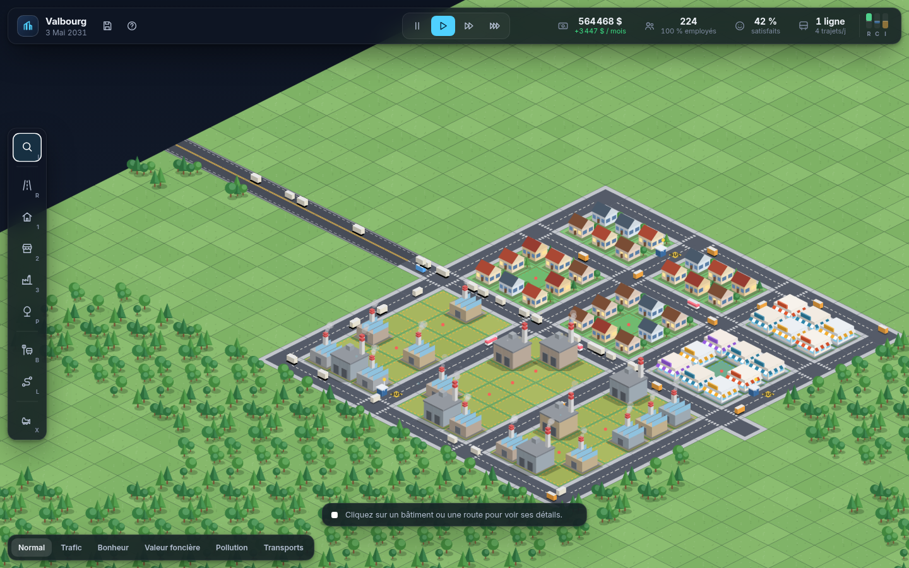

# Metropolis : city builder en Canvas



City builder isométrique jouable dans le navigateur. Stack : Vite, TypeScript strict et Canvas 2D. Aucun moteur de jeu ni framework UI, et aucun asset externe : tout le graphisme est généré par le code et la police Inter est embarquée.

## Lancer le jeu

```bash
cd city-builder
npm install
npm run dev        # http://localhost:5173
```

Autres commandes :

| Commande | Effet |
|---|---|
| `npm test` | Tests de la simulation (Vitest, sans navigateur) |
| `npm run typecheck` | Vérification TypeScript stricte |
| `npm run build` | Typecheck puis build de production dans `dist/` |
| `npm run preview` | Sert le build de production |

## Commandes de jeu

| Action | Contrôle |
|---|---|
| Outils | `I` inspecter · `R` route · `1` `2` `3` zones R/C/I · `P` parc · `B` arrêt de bus · `L` ligne de bus · `X` démolir |
| Tracer / zoner / démolir | Clic gauche glissé (route en L, rectangle pour les zones et la démolition) |
| Ligne de bus | Cliquer les arrêts dans l'ordre, puis recliquer le 1er arrêt ou `Entrée` · `Retour arrière` annule le dernier · `Échap` abandonne |
| Caméra | Molette pour le zoom · clic droit ou molette glissé pour déplacer · `WASD`, `ZQSD` ou flèches |
| Temps | `Espace` pause · `+` / `−` vitesse (×1, ×2, ×4) |
| Vues | `O` fait défiler les vues : trafic, bonheur, valeur foncière, pollution, transports |
| Partie | `Ctrl+S` sauvegarder · `H` menu et aide |

## Mécaniques de simulation

**1. Construction et zonage.** Une grille de 64 × 64 cases. Les routes se tracent en L et se raccordent automatiquement (virages, intersections, passages piétons). Une parcelle zonée R, C ou I se développe si elle touche une route reliée à l'autoroute et si la demande RCI est positive. Chaque bâtiment évolue sur trois niveaux, avec un modèle visuel différent par niveau et quatre variantes de couleur :
- **R** : maison, immeuble, tour ;
- **C** : boutique, bureaux, gratte-ciel ;
- **I** : atelier, entrepôt, complexe à silos.

Pour monter de niveau, un bâtiment doit être plein, la demande doit suivre et, pour R et C, la valeur foncière doit être suffisante. Un bâtiment coupé de l'autoroute pendant 35 jours est abandonné.

**2. Économie.** Trois sources de recettes et quatre postes de dépenses, détaillés dans le panneau Budget :
- **Recettes** : un impôt réglable par zone (salaires pour R, ventes pour C, production pour I, de 0 à 20 %) et les billets de bus.
- **Dépenses** : le coût de construction (routes, zonage, parcs, arrêts, lignes et bus), l'entretien quotidien des routes, des parcs, des arrêts et des bus, et les démolitions.

Le panneau tient un bilan mensuel et affiche une projection, avec l'historique de la trésorerie et des flux sur 18 mois. Quand la trésorerie est négative, plus rien ne peut se construire.

**3. Citoyens (agents).** Chaque habitant est simulé individuellement :
- **Arrivée** : les habitants arrivent par l'autoroute quand des logements sont libres et que la ville attire.
- **Emploi** : chacun cherche l'emploi accessible le moins coûteux, dans le commerce ou l'industrie (Dijkstra sensible aux bouchons), puis choisit entre la voiture et le bus.
- **Besoins** : chaque habitant consomme des biens chaque jour, achetés dans un commerce proche. Les clients se répartissent entre les commerces selon leur capacité de vente.
- **Bonheur** : il dépend des impôts, de l'emploi, de la durée du trajet, des biens disponibles, des parcs, de la pollution, de la desserte en bus et de la valeur foncière.
- **Départ** : un habitant durablement malheureux quitte la ville.

**4. Chaîne de production.** Les usines produisent des biens en fonction de leurs ouvriers et de leur niveau. Des camions, qui circulent réellement sur les routes et ajoutent du trafic, les livrent aux commerces qui en manquent le plus. Les commerces les vendent ensuite aux habitants. Le surplus est exporté par l'autoroute, moins cher. S'il n'y a pas d'industrie locale, les commerces importent au prix fort, ce qui relance la demande industrielle.

**5. Trafic et transports en commun.**
- **Charge** : chaque tronçon de route porte une charge en trajets par jour (navetteurs, camions, bus) face à une capacité donnée.
- **Coût** : le coût de passage croît avec le carré de la congestion. Les trajets se redistribuent donc d'eux-mêmes, et les véhicules ralentissent visiblement dans les bouchons.
- **Bus** : on pose des arrêts sur les routes et on trace des lignes en boucle, avec un nombre de bus réglable. Un habitant prend le bus quand c'est moins coûteux (marche + attente + trajet, sans subir les bouchons). Chaque usager retire une voiture de la route.
- **Portée** : les habitants acceptent des trajets plus longs en bus (62 contre 38 en voiture), ce qui leur permet de travailler plus loin. La desserte améliore aussi le bonheur et la valeur foncière.

**Sauvegarde.** La partie est stockée dans `localStorage`, automatiquement chaque mois, à la fermeture de l'onglet et sur `Ctrl+S`. On la reprend avec « Continuer la partie ».

## Architecture

```
src/
  core/     config.ts (tout l'équilibrage), types.ts, rng.ts (PRNG + bruit)
  sim/      world.ts       grille, terrain procédural, réseau routier, connectivité
            pathfinding.ts Dijkstra sur tas binaire, sans allocation
            traffic.ts     charges par tronçon, coût et vitesse liés à la congestion
            transit.ts     lignes, matrice arrêt-à-arrêt (Floyd–Warshall), couverture, bus
            citizens.ts    agents : emploi, mode de transport, bonheur, migration
            production.ts  usines, camions, commerces, import/export
            growth.ts      demande RCI, développement, niveaux, abandon
            environment.ts pollution et valeur foncière
            economy.ts     trésorerie, impôts, bilans mensuels
            simulation.ts  orchestrateur : temps, actions du joueur, événements
            save.ts        sérialisation versionnée vers localStorage
  render/   camera.ts, sprites.ts (art procédural mis en cache), renderer.ts, particles.ts
  input/    tools.ts       gestes → actions, aperçus et coûts
  ui/       game-ui.ts     HUD, panneaux, inspecteur, modales ; charts.ts ; dom.ts ; icons.ts
tests/      simulation.test.ts, mechanics.test.ts
```

La simulation ne dépend pas du DOM : elle tourne telle quelle dans les tests. Toutes les actions du joueur passent par `Simulation`, si bien que les coûts et les effets de bord sont les mêmes depuis l'UI et depuis les tests.

**Performances mesurées** sur une ville de 4 500 habitants et 720 bâtiments : environ 9 ms par jour simulé en moyenne, 26 ms au pire. À vitesse ×1, un jour dure 800 ms.
